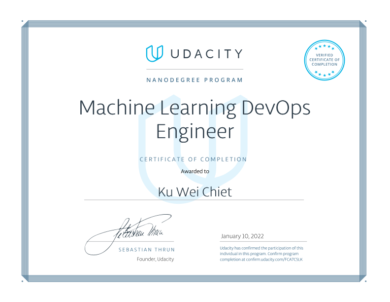

# Machine Learning DevOps Engineer Nanodegree

## Program Description  
The Machine Learning DevOps Engineer Nanodegree program focuses on the software engineering fundamentals needed to successfully streamline the deployment of data and machine-learning models in a production-level environment. Students will build the DevOps skills required to automate the various aspects and stages of machine learning model building and monitoring over time.

Students who graduate from the [program](https://www.udacity.com/course/machine-learning-dev-ops-engineer-nanodegree--nd0821) will be able to:
* Implement production-ready Python code/processes for deploying ML models outside of
cloud-based environments facilitated by tools such as AWS SageMaker, Azure ML, etc.
* Engineer automated data workflows that perform continuous training (CT) and model
validation within a CI/CD pipeline based on updated data versioning.
* Create multi-step pipelines that automatically retrain and deploy models after data updates.
* Track model summary statistics and monitor model online performance over time to prevent
model-degradation.

[Graduation Certificate](https://confirm.udacity.com/FCA7C5LK)

## Course Syllabus
### 1. **Clean Code Principles**
Develop skills that are essential for deploying production machine learning models. First, you will put your coding best practices on autopilot by learning how to use PyLint and AutoPEP8. Then you will further expand your Git and Github skills to work with teams. Finally, you will learn best practices associated with testing and logging used in production settings to ensure your models can stand the test of time.

  **[Project 1: Predict Customer Churn with Clean Code](./project_1)**
  * In this project, you will implement your learnings to identify credit card customers that are most likely to churn. The completed project will include a Python package for a machine learning project that follows coding (PEP8) and engineering best practices for implementing software (modular, documented, and tested). The package will also have the flexibility of being run interactively or from the command-line interface (CLI). This project will give you practice using your skills for testing, logging, and coding best practices from the lessons. It will also introduce you to a problem data scientists across companies face all the time: How do we identify (and later intervene with) customers who are likely to churn?

### 2. **Building a Reproducible Model Workflow**
This course empowers the students to be more efficient, effective, and productive in modern, real-world ML projects by adopting best practices around reproducible workflows. In particular, it teaches the fundamentals of MLops and how to:    
a) create a clean, organized, reproducible, end-to-end machine learning pipeline from scratch using MLflow  
b) clean and validate the data using pytest  
c) track experiments, code, and results using GitHub and Weights & Biases   
d) select the best-performing model for production  
e) deploy a model using MLflow   
Along the way, it also touches on other technologies like Kubernetes, Kubeflow, and Great Expectations and how they relate to the content of the class.

  **[Project 2: Build an ML Pipeline for Short-term Rental Prices in NYC](https://github.com/weichiet/nd0821-c2-build-model-workflow-starter)**
  * Students will write a Machine Learning Pipeline to solve the following problem: a property management company is renting rooms and properties in New York for short periods on various rental platforms. They need to estimate the typical price for a given property based on the price of similar properties. The company receives new data in bulk every week, so the model needs to be retrained with the same cadence, necessitating a reusable pipeline. The students will write an end-to-end pipeline covering data fetching, validation, segregation, train and validation, test, and release. They will run it on an initial data sample, and then re-run it on a new data sample simulating a new data delivery.

### 3. **Deploying a Scalable ML Pipeline in Production**
This course teaches students how to robustly deploy a machine learning model into production. En route to that goal students will learn how to put the finishing touches on a model by taking a fine grained approach to model performance, checking bias, and ultimately writing a model card. Students will also learn how to version control their data and models using Data Version Control (DVC). The last piece in preparation for deployment will be learning Continuous Integration and Continuous Deployment which will be accomplished using GitHub Actions and Heroku, respectively. Finally, students will learn how to write a fast, type-checked, and auto-documented API using FastAPI.

  **[Project 3: Deploying a Machine Learning Model on Heroku with FastAPI](https://github.com/weichiet/Deploying-a-Machine-Learning-Model-on-Heroku-with-FastAPI)**
  * In this project, students will deploy a machine learning model on Heroku. The students will use Git and DVC to track their code, data, and model while developing a simple classification model on the Census Income Data Set. After developing the model the students will finalize the model for production by checking its performance on slices and writing a model card encapsulating key knowledge about the model. Students will put together a Continuous Integration and Continuous Deployment framework and ensure their pipeline passes a series of unit tests before deployment. Lastly, an API will be written using FastAPI and will be tested locally. After successful deployment the API will be tested live using the requests module.

  After completion, the student will have a working API that is live in production, a set of tests, model card, and full CI/CD framework. On its own, this project can be used as a portfolio piece, but also any of the constituent pieces can be applied to other projects, e.g. continuous integration, to further flesh them out.

### 4. **Automated model scoring and monitoring**
This course will help students automate the devops processes required to score and re-deploy ML models. Students will automate model training and deployment. They will set up regular scoring processes to be performed after model deployment, and also learn to reason carefully about model drift, and whether models need to be retrained and re-deployed. Students will learn to diagnose operational issues with models, including data integrity and stability problems, timing problems, and dependency issues. Finally, students will learn to set up automated reporting with API’s.

  **[Project 4: A Dynamic Risk Assessment System](./project_4)**
  * In this project, students will make predictions about attrition risk in a fabricated dataset. They’ll set up automated processes to ingest data and score, re-train, and re-deploy ML models that predict attrition risk. They’ll write scripts to automatically check for new data and check for model drift. They’ll also set up API’s that allow users to access model results, metrics, and diagnostics. After completing this project, students will have a full end-to-end, automated ML project that performs risk assessments. This project can be a useful addition to students’ portfolios, and the concepts they apply in the project can be applied to business problems across a variety of industries.
